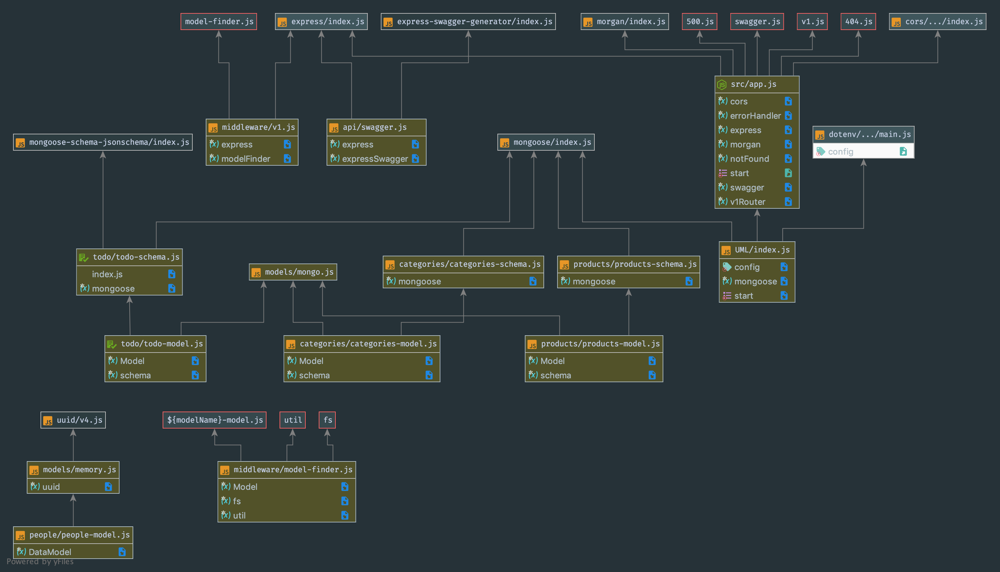
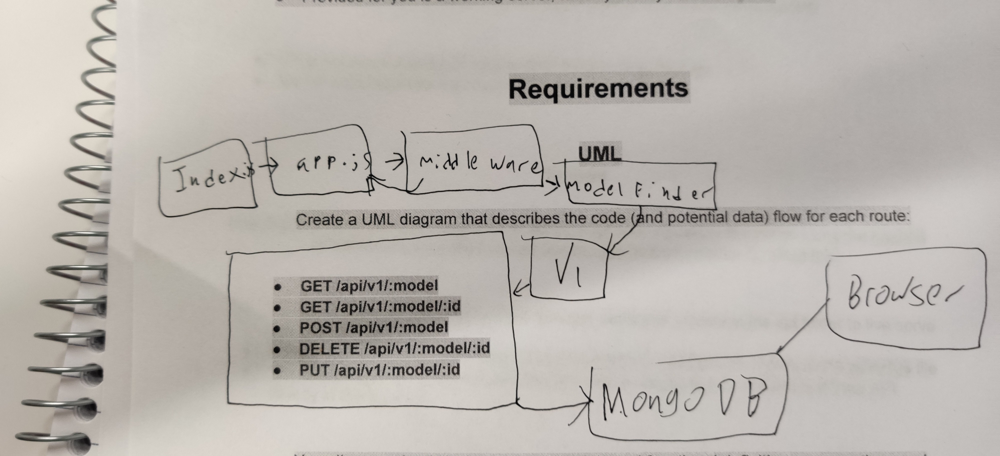

# LAB - 09
## API Server

### Author: Evan Brecht-Curry

### Links and Resources
* [submission PR](https://github.com/evan-401-advanced-javascript/lab-9-api-server/pull/1)
* [travis](https://www.travis-ci.com/evan-401-advanced-javascript/lab-9-api-server)
* [heroku](http://xyz.com) 

#### Documentation
* [jsdoc](https://evan-lab-5.herokuapp.com/docs/) (Server assignments)

### Modules
* `GET /api/v1/:model` 
This function takes in a request response and next and returns all of the data from the get model and a 200 message to the browser. Its output is the number of objects in the database as well as the data object.
* `GET /api/v1/:model/:id`
This function takes in a request response and next and returns one piece of data from the get model and a 200 message to the browser. Its output is the first piece of JSON from the result object.
* `POST /api/v1/:model`
This function takes in a request response and next. The function adds one piece of data from the results object from the database. it returns the json object and a 200 message to the browser. Its output is the object that has been added in the database.
* `PUT /api/v1/:model/:id`
This function takes in a request response and next. The function updated one piece of data from the results object from the database. it returns the json object and a 200 message to the browser. Its output is the object that has been updated in the database.
* `DELETE /api/v1/:model/:id`
This function takes in a request response and next. The function deleted one piece of data from the results object from the database. it returns the json object and a 200 message to the browser. Its output is the object that has been deleted in the database.

### Setup
#### `.env` requirements
* `PORT` - 3000
* `MONGODB_URI` - mongodb://localhost:27017/lab-9

#### Running the app
* `npm start`

* Endpoint: `/docs`
  * Returns JS docs.

#### UML
UML Route definitions listed above

